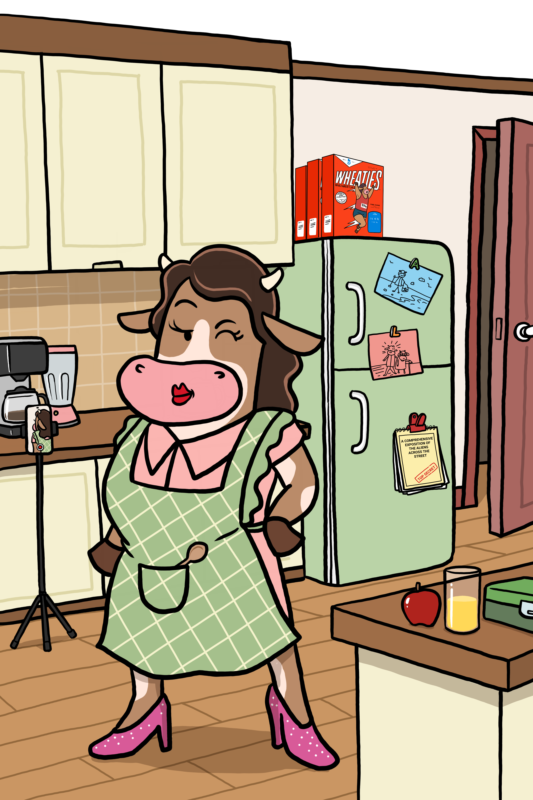

*Mom doesn't check the ticker. She checks the pasture.*

---

**Most crypto charts look like a roller coaster designed by someone with a personal grudge.**

Why volatile price swings cause panic and how stablecoins provide a calm dock.

> 💡 **Herd Glossary: Stablecoin**  
> A digital dollar (like USDC) designed to stay pegged to $1.00 so your balance remains steady while the market swings.

---

  <b>Making crypto less scary, one cartoon cow at a time.</b>  
  👉 <b>Herd up free.</b>

