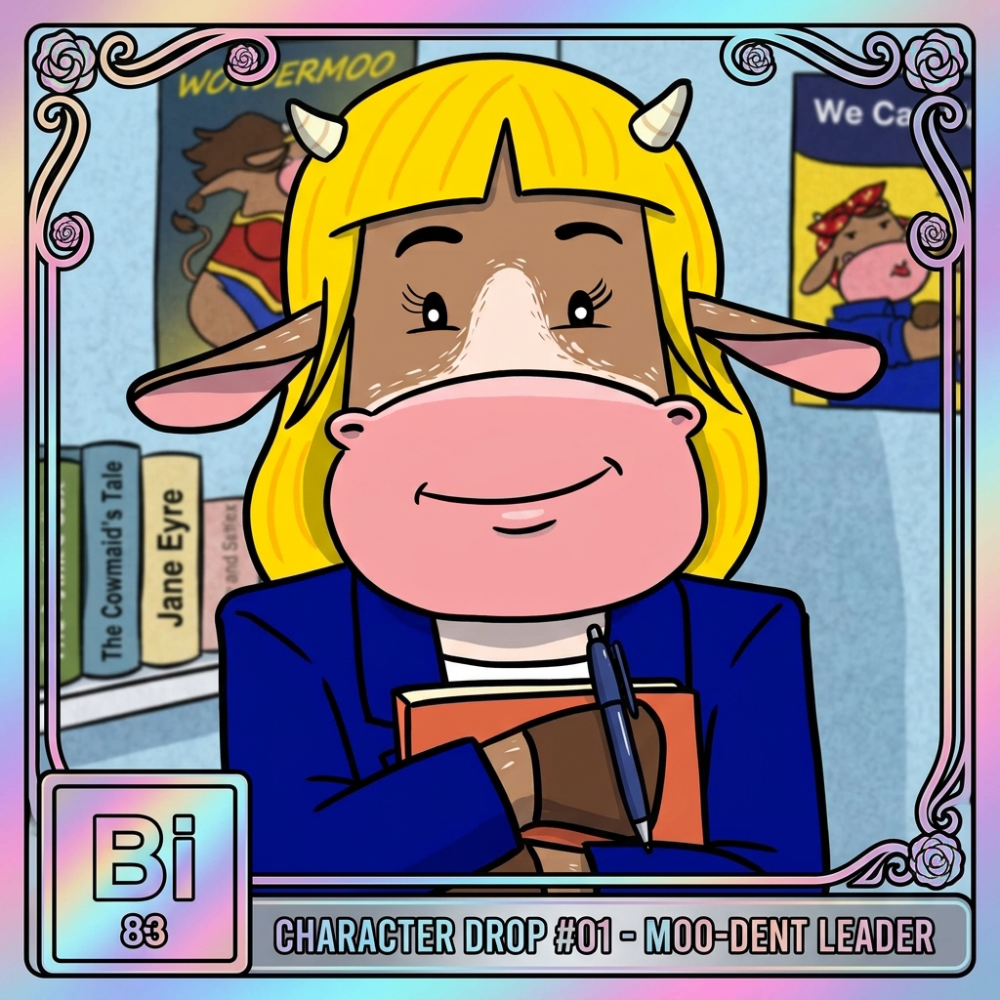

# Meet the Herd: Blue Twin (Bi) on Regulation, Compliance & Rights

### One character, one lane, and zero lore dumps.

  
   
  <em>Actually reads the terms of service and regulatory disclosures.</em>

---

**Blue Twin (Bi) brought a highlighter, a binder, and thirty pages of compliance filings to the morning pasture meeting.**

Bismuth is architectural, vibrant, and precise. Regulation can sound dry, but Blue Twin understands that clear legal guardrails are what turn experimental technology into institutional infrastructure. She stands at the fence line making sure bad actors stay out and everyday users keep their rights.

> 💡 **Pasture Role:** Blue Twin (Bi) leads the educational lane for **Regulation, Compliance & Rights**.

---

  <b>Meet the family turning finance into plain English.</b>  
  👉 <b>Herd up free.</b>

