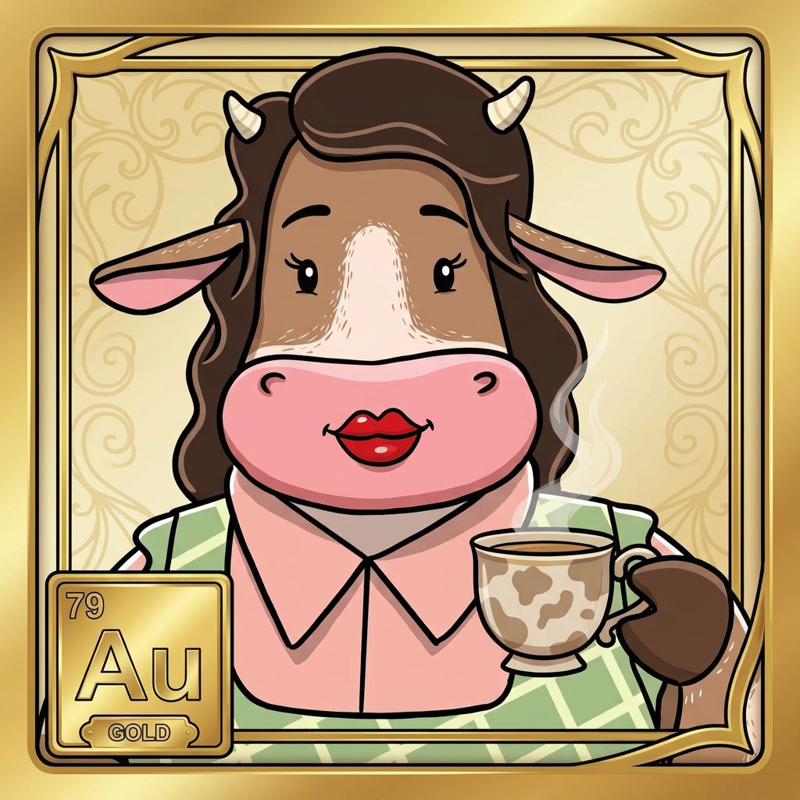

# Meet the Herd: Mom (Au) on Volatility & Stablecoins

### One character, one lane, and zero lore dumps.

  
   
  <em>Unbothered by red candles, unimpressed by green spikes.</em>

---

**When prices start swinging like a rodeo gate, Mom (Au) pulls on her green plaid vest and turns the kettle on.**

Gold has anchored monetary systems for millennia because it doesn't flinch when headlines get dramatic. In the pasture, Mom represents emotional discipline, balance management, and the power of stable value. Her rule is simple: if market volatility is keeping you awake at night, you don't understand your exit dock yet. In a world obsessed with 100x gains, Mom teaches you how to keep what you've already built.

> 💡 **Pasture Role:** Mom (Au) leads the educational lane for **Volatility & Stablecoins**.

---

  <b>Meet the family turning finance into plain English.</b>  
  👉 <b>Herd up free.</b>

