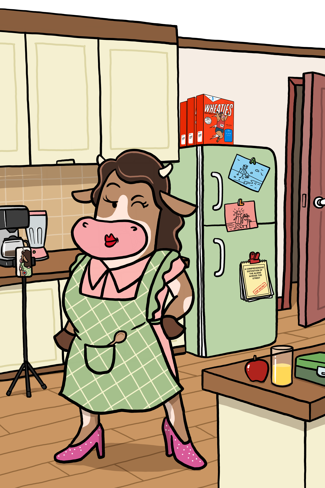

# Why Does the Market Move Like That? A Pasture Guide to Volatility and Stablecoins

### Mom (Au) explains why crypto charts look like roller coasters, why volatility isn't the enemy, and how digital dollars keep everyday families grounded.

  
   
  <em>Mom doesn't check the 1-minute candle chart. She checks the pasture.</em>

---

## The Anatomy of a Crypto Swing

Most cryptocurrency price charts look like an EKG recorded during a lightning strike. If you are new to digital finance, waking up to see an asset you bought yesterday swing 15% by lunch can feel like watching your checking account ride a mechanical bull. It is the single biggest reason 70% of crypto owners report feeling overwhelmed, and why millions of everyday families stay outside the pasture fence.

Mom (Au) doesn’t panic. She puts the kettle on, pulls on her green plaid vest, and looks past the noise. Gold has anchored monetary history for thousands of years because it doesn't bend every time the wind blows. In the CryptoCowz universe, that is Mom’s job: to teach the difference between market weather and actual structural value, and to show newcomers where the calm ground is.

---

## 1. Why Does Crypto Move Like That?

In the traditional stock market, companies report earnings quarterly, markets close at 4:00 PM, and circuit breakers freeze trading if prices drop too fast.

Crypto doesn't have closing bells, weekends, or bank holidays. It is a 24/7 global auction running across dozens of time zones simultaneously. More importantly, most crypto assets are in their price discovery phase. When a new technology emerges, nobody knows the exact equilibrium price yet.

High volatility makes an asset attractive for speculators looking for adrenaline, but stressful for buying groceries or budgeting for a household. If money loses 10% of its purchasing power between the checkout line and the receipt printing, it isn't behaving like money yet.

---

## 2. Enter the Stablecoin: The Concrete Dock

If Bitcoin and Ethereum are open, choppy seas, stablecoins are the concrete dock where your boat stops spinning.

A stablecoin is a digital token engineered to stay pegged to an external benchmark—most commonly the United States Dollar ($1.00 USD). For every digital dollar issued on-chain, reputable issuers hold cash equivalents and short-term US Treasuries in audited reserve accounts.

Why does this matter for ordinary people? Because it gives you the speed, borderless reach, and programmatic power of a blockchain without exposing your grocery fund to the market rollercoaster. You don’t have to cash out into a commercial bank or wait three business days over a holiday weekend. With a single tap, you park volatile assets into digital dollars and let the storm pass.

---

## 3. The Real-World Alpha: Why Merchants Are Watching

Stablecoins aren't just a shelter for traders; they are the bridge to Capitalism 2.0.

Every time you swipe a traditional credit card at a local shop, the retailer pays a fee of roughly 3.0% to legacy processing networks. A standard bank debit card costs them about 1.5%. On a $100 purchase, credit cards siphon $3.00, debit siphons $1.50, but digital dollars on high-speed rails (like USDC on Solana) settle for less than $0.001 in under two seconds.

What iTunes did to record stores, digital dollar settlement is poised to do to legacy swipe fees. By eliminating price swings with stablecoins, retailers can embrace digital payments without worrying that tomorrow's revenue won't cover today's inventory.

---

## 4. Mom’s 3 Pasture Rules for Market Swings

1. Never Risk the Winter Hay: Only allocate capital to volatile assets if you don’t need that money for immediate living expenses. Your rent and emergency savings belong in calm waters.

2. Separate Speculation from Utility: Understand what you are holding. A meme coin behaves differently than a network protocol with real fee revenue, and both behave differently than a stablecoin.

3. Know Where the Dock Sits: Before entering any position, know how to swap into a stablecoin. Practicing when the market is quiet prevents mistakes when emotions run hot.

---

> 💡 **Herd Glossary: Stablecoin**  
> A cryptocurrency whose value is pegged to another currency or asset (most commonly $1.00 USD). Examples include USDC, which provides instant global settlement on blockchain networks without price fluctuations.

---

### Pasture Prompt
When the market gets turbulent, what is your instinctive reaction: do you check charts every ten minutes, ignore your screen entirely, or move to stable ground?

---

  <b>The pasture is open. Learn crypto without the headache.</b>  
  👉 <b>Herd up free.</b>

