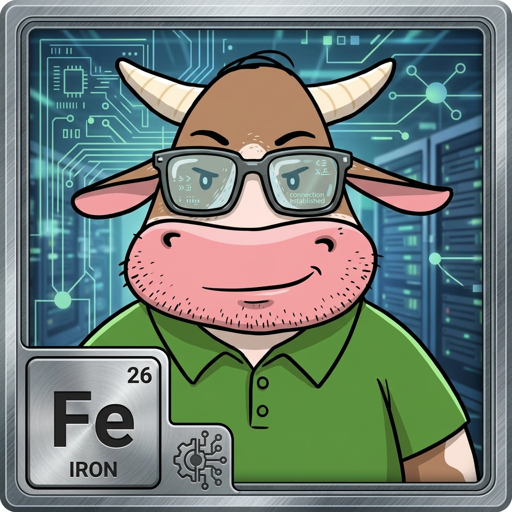

# Meet the Herd: Dad (Fe) on Security, Wallets & Private Keys

### One character, one lane, and zero lore dumps.

  
   
  <em>Has never clicked an unverified email link in his life.</em>

---

**Dad (Fe) has checked the barn padlocks twice, updated his password manager, and still won't let you use the public Wi-Fi.**

Iron represents strength, vaults, and the quiet heavy lifting that keeps things from falling apart. On a blockchain, freedom and responsibility are two sides of the same coin. If you don't control your private keys, you don't own your money. Dad is the resident sentry ensuring the herd learns good habits before paying expensive tuition to an online scam.

> 💡 **Pasture Role:** Dad (Fe) leads the educational lane for **Security, Wallets & Private Keys**.

---

  <b>Meet the family turning finance into plain English.</b>  
  👉 <b>Herd up free.</b>

