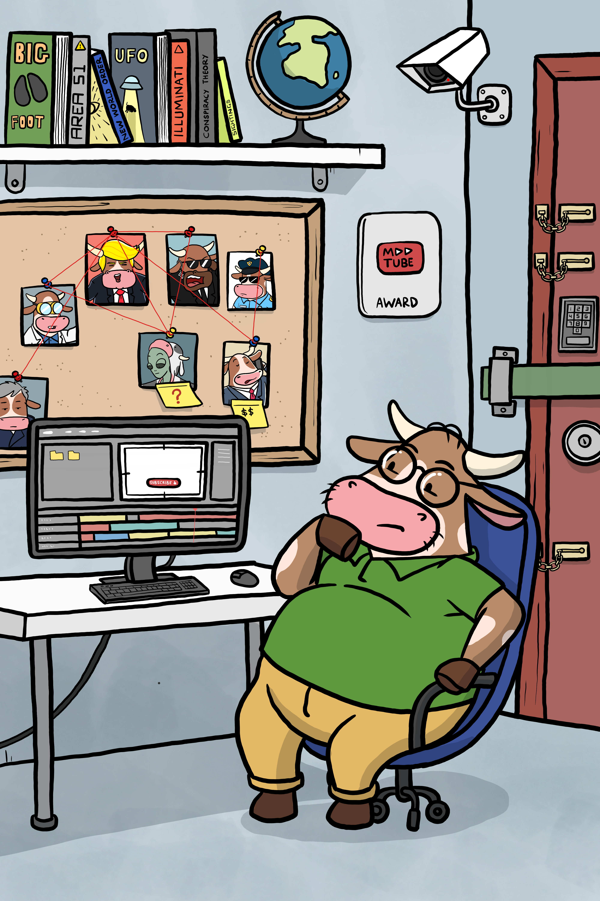

# What the Herd Learned This Week: The Dad (Fe) Report

### Three key takeaways from Dad (Fe) on Security, Wallets & Private Keys, plus what’s grazing next.

  
   
  <em>Dad changed the barn combination again. Because security never takes a day off.</em>

---

### What the Herd Learned This Week

• **Self-Custody Reality:** Centralized exchanges issue promises; private wallets give you mathematical ownership.

• **Zero Digital Footprints for Keys:** Seed phrases must never touch the cloud, camera rolls, or notes apps.

• **Hardware is Essential:** For significant balances, dedicated hardware signing devices isolate keys from compromised laptops.

---

### Grazing Next Week
Son (Ge) takes digital dollars to the street to find out where you can actually buy coffee with crypto.

---

  <b>Never miss a lesson from the pasture.</b>  
  👉 <b>Herd up free.</b>

